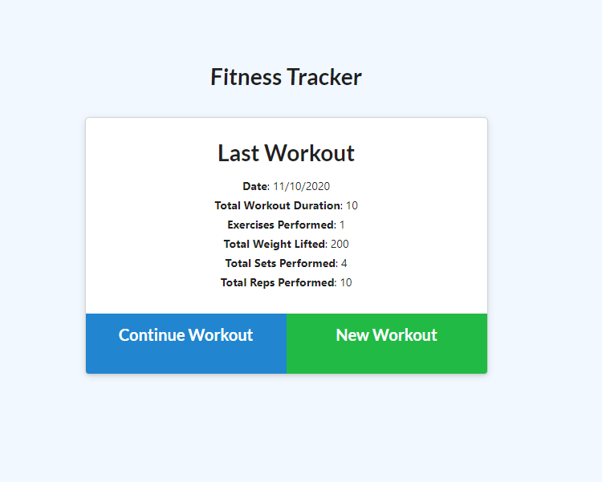

# Workout-Tracker
This is a Node.js exercise Tracking app that allows the user to track their daily workouts.  

[Deployed App in Heroku](https://stark-ravine-88029.herokuapp.com/)

## Table of contents
- [Description](#description)
- [Installation](#installation)
- [Demo](#demo)
- [License](#license)
- [Technologies Used](#technologies-used)
- [Questions](#questions)




## Description

This app allows users to add a new workout or continue with the existing one. Users can log multiple exercises and view the dashboard for the summary graph.

## Installation

1. Clone the Repository

Open your Bash/Terminal an type the following command:
```
git clone https://github.com/ayshasanyang/Workout-Tracker
```
2. Open the project folder in Visual Studio Code can be found [here](https://code.visualstudio.com/download) and type the following command to install the dependencies.
```
npm install

npm run seed
```

3. In you terminal run the following command to start the application type localhost:8080 in your browser:

```
 node server.js
```

## Demo


## License
[](https://opensource.org/licenses/MIT)


## Technologies Used

- JavaScript
- Node.js
- Express
- MongoDB
- MongoDB Atlas
- Heroku

## Questions
For any other questions, please send me an email at: isasanyang1986@yahoo.co.uk